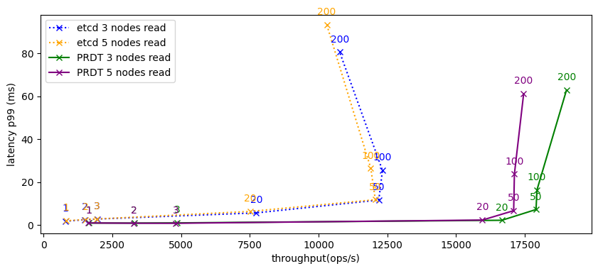
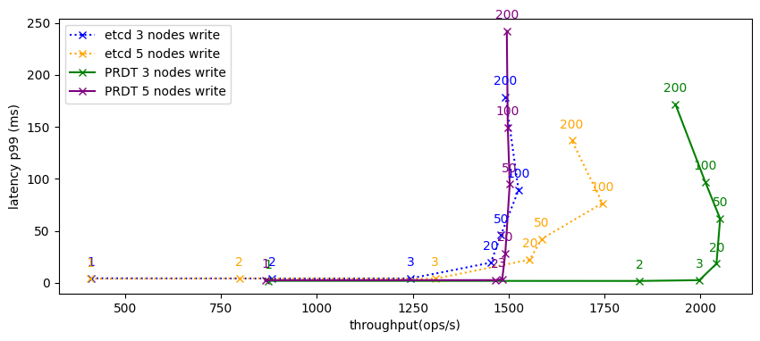
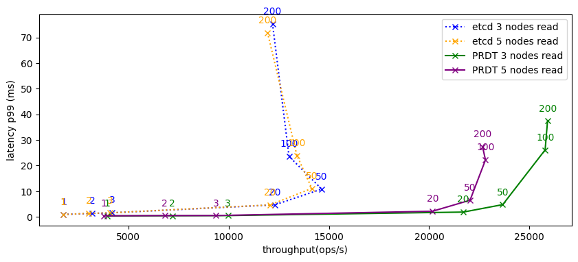
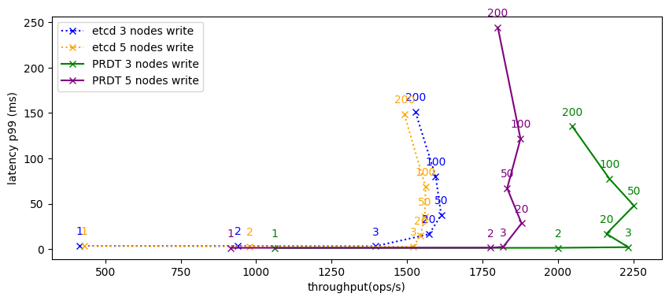

# PRDTs: Composable Design and Verification of Consensus Protocols using Replicated Data Types (Artifact)

This is the artifact for the paper _"PRDTs: Composable Design and Verification of Consensus Protocols using Replicated Data Types"_.

It contains the following components:

- PRDT library & protocol implementations (Scala)
- Performance benchmark
  - Key/value-store implementation (Scala)
  - Benchmark scripts (ansible & fish shell scripts)
  - Analysis scripts (python jupyter notebook)

# Download, Installation, and Sanity-Testing

## Hardware and Software Requirements:

Our performance benchmarks are supposed to be run on cloud infrastructure.
They require at least 4 Ubuntu machines (3 for the cluster, 1 for the benchmark runner) that you have SSH access to. For the artifact evaluation period of OOPSLA26, we give the reviewers access to remote servers that can be used to run our evaluation scripts.
However, if you are reading this after artifact evaluation has ended, you will have to bring your own servers for the remote benchmarks (see the section "Additional Artifact Description" for details).

For orchestrating the benchmarks and executing the other parts of the artifact, we provide two docker images, one for linux/amd64 and one for linux/arm64. The former should work on any 64 bit x86 system while the latter should work on 64 bit arm machines such as those based on Apple silicon chips.

## Download and Installation

Download the artifact from [https://doi.org/10.5281/zenodo.21442650](https://doi.org/10.5281/zenodo.21442650)

There you will find two docker images for easy execution and a zip file containing all the sources (code and scripts) used to build the docker images. The latter can be used to change and reuse the artifact, and to run it without docker.

Make sure that [docker](https://www.docker.com/) is installed on your machine ([podman](https://podman.io/) might work as well).
Then, pick the right docker image for your architecture and load it using:

```bash
docker image load -i dockerimage_amd64.tar # for x86
```

```bash
docker image load -i dockerimage_arm64.tar # for ARM
```

## Sanity Testing (kick-the-tires)

**Visualizing the Benchmark Results:**

After loading the image, copy the `/datasets/paper_dataset` folder from the zip file that came with the artifact. It contains the benchmark results that were used to produce the figures in the paper.

Then, start the docker container from the folder containing the `paper_dataset` folder:

```bash
docker run --rm -it -v ./paper_dataset:/app/results -p 8888:8888  prdt-artifact
```

This should open an interactive shell from which you can run various scripts.

Try running the following command to start a jupyter notebook to analyze the pre-supplied benchmark results.

```bash
scripts/run-jupyter.fish
```

This should print a URL like `http://127.0.0.1:8888/tree?token=...` to your terminal. Copy this URL and paste it into a webbrowser.
Inside the jupyter menu, select the "Data_Center.ipynb" notebook and run it via "Kernel > Restart Kernel and Run All Cells". This should produce several tables and plots.

**Running Cloud Benchmarks:**

Next, we are going to perform a benchmark run on our supplied cloud-infrastructure.

> _Disclaimer: These scripts should only be run by one reviewer at a time since they run on the same infrastructure and running multiple benchmarks at once will affect the results._

Go back to the terminal running the jupyter notebook and stop it with Ctrl-C. Then, stop the running docker container (e.g. via Ctrl-D).

Create a folder to hold your benchmark results, e.g. `my_dataset`. Then mount it into the docker container using

```bash
docker run --rm -it -v ./my_dataset:/app/results -p 8888:8888  prdt-artifact
```

Try to run a benchmark on our supplied cloud-infrastructure:

```bash
scripts/test-benchmark-cloud.fish
```

This should run two simple benchmarks which takes around 7 minutes.
There might be ansible deprecation warnings but the script should still run and in the end the results should show up in your `myresults` folder.
After the benchmark has finished, you can start up the jupyter notebook again with the `scripts/run-jupyter.fish` command to inspect the results.
Open the `Data_Center` notebook and re-run it via “Kernel > Restart Kernel and Run All Cells”.

The notebook will fail to evaluate the later half of the cells because it is missing input data. This is expected and okay for now.

# Evaluation Instructions

> _If you run into problems, see the Troubleshooting section at the end of the document._

The main evaluation workflow when interacting with the artifact consists of two steps:

1. mount a dataset into the docker container
2. populate/analyze the dataset with the scripts in the `scripts` folder

**Loading a dataset:**

To load a dataset, mount it into the docker container. For example, to load the `paper_dataset`, run:

```bash
docker run --rm -it -v ./paper_dataset:/app/results -p 8888:8888  prdt-artifact
```

**Analyzing a dataset:**

To analyze a dataset, run our jupyter notebook with:

```bash
scripts/run-jupyter.fish
```

In the command output, look for a line containing an URL like `http://127.0.0.1:8888/tree?token=...`, copy the URL and open it with a browser. In jupyter, select and open one of the three notebooks corresponding to the benchmark you want to analyze. You can run the notebook via “Kernel > Restart Kernel and Run All Cells”. This will produce the figures from the Evaluation section of the paper.
The notebooks also allows you to inspect the data interactively and create new analyses.

By default, each notebook considers the **3 newest runs** per configuration (same workload, same number of servers, same system).

**Populating a dataset:**

In order to create a new dataset `my_dataset`, restart the container (Ctrl-C, Ctrl-D):

```bash
mkdir my_dataset
docker run --rm -it -v ./my_dataset:/app/results -p 8888:8888  prdt-artifact
```

You can then use the scripts in the `scripts` folder to populate the dataset.

> _Disclaimer: the cloud scripts should only be executed one at a time (by one reviewer at a time) because they will run on the same infrastructure, which will affect the results._

You can produce a complete dataset (read/write benchmarks, leader failure, geo-replication, 3 runs per config) with the following command. **Beware: The script takes about 17h to finish.**
You can control the `RUNS` variable to do less runs per config.

```bash
RUNS=3 scripts/all-benchmarks.fish
```

For a slightly quicker option, you can run individual benchmark scripts:

```bash
RUNS=3 scripts/datacententer-benchmarks.fish # ~10h
RUNS=3 scripts/geo-repl-benchmarks.fish # ~5h
RUNS=3 scripts/leader-failure-benchmark.fish # ~90min
```

For the quickest option, you can run a single cloud benchmark using:

```bash
NUM_NODES=3 THREADS=10 WORKLOAD=writeonly scripts/run-benchmark-cloud.fish
```

This will provision the needed cloud servers, run the benchmark for both systems, retrieve the results into the dataset, and remove the servers again.
`NUM_NODES` controls the amount of physical machines that will be part of the cluster, while `THREADS` controls how many client threads will be stressing the system concurrently. `WORKLOAD` sets the YCSB workload that is going to be executed. We support `workloadb` (read-mostly workload) and `writeonly` (only writes).
**Each benchmark run takes ~7 minutes including setup and teardown.**

**Interpreting the results:**

Your results will likely differ from the ones that we reported in the paper.
In particular, there will always be a certain randomness factor when relying on cloud infrastructure. Any consensus-based key-value store is highly latency sensitive and we cannot control the exact location of the node machines. They will be located in the same data center but their exact location in the data center and the general network load of the data center will affect performance results.
To ensure a fair comparison, our scripts always run the benchmark for both systems (etcd and ours) on the same servers befor tearing them down again.

To make things worse, our cloud provider hetzner seems to be experiencing a high load on their cloud instances right now ([source](https://status.hetzner.com/incident/0a75c7ae-3377-41dc-aabe-601063724d24)), which can affect latencies.
However, this affects both systems equally, and thus the general trends and observations that we describe in the paper still stand: With all nodes in the same data center, both systems perform comparably for writes, and our system outperforms etcd for reads.

See the reproducibility guidelines for further discussion.

# Reusability Guidelines

The main reusable component of our artifact is the PRDT library (written in Scala) that allows users to implement new protocols through composition (see Section 4 of the paper for a tour).
We develop the library in the context of the Bismuth project and our PRDT components are included in its RDT library. Development happens on [Github](https://github.com/stg-tud/Bismuth) and we publish [Maven artifacts](https://index.scala-lang.org/stg-tud/bismuth/artifacts/rdts?pre-releases=false) that allow developers to easily include the library into their Scala projects. The code is licensed under Apache License 2.0 license.

We also include the library as part of this artifact in the `src` folder. The version included in this artifact is also available under the following git tag: https://github.com/stg-tud/Bismuth/tree/2026-prdt-oopsla26-artifact.

## Navigating the Source Code

See `src/Bismuth/Modules/RDTs/src/main/scala/rdts/protocols` for everything PRDT related. This includes a slightly extended version of the `Paxos` implementation from the paper, the `MultiPaxos` implementation that we use in our benchmarks, and other components such as `Voting` that we introduce in Section 2 of the paper.

You can find the Paxos variants from Section 4.2 - 4.4 in the folder `rdts/protocols/paxosVariants`.

Our key-value store implementation as well as the YCSB adapters used for our performance evaluation can be inspected in the `src/Bismuth/Modules/Protocol Benchmarks` module.

## Implementing Custom PRDTs (Reusability Scenario)

Section 4.2 of the paper already sketches how one could start designing custom PRDTs for various scenarios.
In order to allow further experimentation with the library, we include an example Scala project in `src/example-project`.

This project demonstrates how to use the PRDT library as a dependency in order to implement custom protocols. It implements an optimized version of the MultiPaxos presented in the paper (Section 4.3).

Load the project in sbt (a Scala build tool) using:

```bash
docker run --rm -it -v ./src/example-project:/app --entrypoint sbt prdt-artifact
```

Verify that the project compiles by entering `compile` into the sbt shell.

Next, open the file `example-project/src/main/scala/ParallelMultiPaxos.scala` in your favourite text editor.

The idea behind `ParallelMultiPaxos` is to allow multiple Paxos instances to be run in parallel using one instance for each log entry. This is reflected by the case class definition:

```scala
case class ParallelMultiPaxos[A](
    log: Map[Long, Paxos[A]] = Map.empty[Long, Paxos[A]],
    commitIndex: Long = -1
)
```

The log is a map from log index to Paxos instance. In addition, we keep a commit index that tracks which Paxos instances have come to a decision. An index of 2 would mean that instances 0-2 are decided already.

Given this case class definition, our library can derive a merge function semi-automatically. Look for the following code at the bottom of the file:

```scala
given [A]: Lattice[ParallelMultiPaxos[A]] =
  given Lattice[Long] = Math.max
  Lattice.derived
```

We only need to define how to merge Longs (for the commit index) and the rest can be derived automatically because the library already knows how to merge Maps of `Paxos` instances.

Next, look at the `read` function of ParallelMultiPaxos:

```scala
def read(using Participants): List[A] =
  // return values in log order but only if all previous rounds are decided
  NumericRange(0L, log.size.toLong, 1L).view
    .flatMap(log.get)
    .filter(_.result.isDefined) // TODO: THIS IS A BUG!
    // FIX: return log until first undecided round
    //.takeWhile(_.result.isDefined)
    .map(_.result.get)
    .toList
```

`read` simply checks which Paxos instances already have a result (have come to a decision), and returns their values sorted by log index.
However, the current implementation contains a bug: It simply ignores undecided log entries and might return a decision for slot 2 before there is a decision for slot 1. This violates `action monotonicity` (Definition 3.7) because we could go from `Log(2)` to `Log(1,2)` which violates the standard decision order for log-based consensus which is that we can only _append_ to the log!

Our PRDT library makes it easy to catch these kinds of bugs in a Scala project and generate counter-examples through property-based testing.
The file `example-project/src/test/scala/PropertyBasedParallelMultipaxos.scala` demonstrates how to implement a simple property-based test suite. The test suite simulates a number of `ParallelMultipaxos` instances, executes a series random protocol actions for each instance and merges the instances from time to time to simulate network communication.

Run the test by entering `test` into the sbt shell. This should fail and print some relatively verbose output. Scroll up to find the failing property. The output should print one of the following properties (the exact values might differ):

```
every log is a prefix of another log or vice versa, but we had:
left: List(-1102037233, -1)
right: List(-1)
```

```
local logs grow monotonically, but went from
List() to List()
and
List(1798591263) to List(1770191727, 1798591263)
```

In order to fix the bug, go back to `ParallelMultiPaxos.scala` and replace the `.filter` line by the `takeWhile` line as indicated by the comments.
This changes our read logic such that we return the results of the individual Paxos instances in order and do not skip over undecided entries.
Your new version should look like this:

```scala
def read(using Participants): List[A] =
  // return values in log order but only if all previous rounds are decided
  NumericRange(0L, log.size.toLong, 1L).view
    .flatMap(log.get)
    //.filter(_.result.isDefined) // TODO: THIS IS A BUG!
    // FIX: return log until first undecided round
    .takeWhile(_.result.isDefined)
    .map(_.result.get)
    .toList
```

Rerun the test by entering `test` in the sbt shell. The output should report all tests as succeeded.

# Reproducibility guidelines

Our evaluation makes one central claim:

- **Practical Feasability (Section 5):** PRDTs achieve performance comparable to established consensus implementations in real-world applications.

This claim can be evaluated by running the `all-benchmarks.fish` script and comparing the results for our PRDT-based system to etcd as described in the evaluation intructions.
While the exact performance numbers are dependent on the performance of the cloud environment, this should affect both systems and should not violate our main claim of comparable performance.

See the following figures for a comparison between the performance measurements that we conducted at paper submission time (first) and during artifact preparation (second).

**Paper Results:**




**Artifact Preparation Results** (changes are due to varying network latency, but still show the same trends):




# Additional artifact description

This section describes additional parts of the artifact that were not discussed in the previous sections which might be interesting for the curious reader beyond artifact evaluation.
At the end of the section we also provide some troubleshooting guidance if anything goes wrong while following the evaluation instructions.

## `/ansible`:

Contains various ansible playbooks that we use to setup the servers, install the necessary software and orchestrate the different benchmark scripts. Refer to the scripts in `/scripts` to see how they are called.
We believe they are fairly reusable and could potentially serve as a foundation for benchmarking other systems with YCSB.

If you want to run the scripts without our supplied infrastructure, you need at least 4 Ubuntu machines (1 for the benchmark runner, 3 for the nodes) that you have ssh access to. Then, prepare an [ansible inventory](https://docs.ansible.com/projects/ansible/latest/inventory_guide/intro_inventory.html) for your machines. You need to define the groups `nodes` and `clients`:

```yaml
# myinventory.yaml
nodes:
  hosts:
    one.example.com:
    two.example.com:
    three.example.com:
clients:
  hosts:
```

Afterwards, use your inventory like this:

```bash
ansible-playbook -i myinventory.yaml ansible/setup-servers.yaml
```

## `/src/stainless`:

This includes the stainless proofs for the `Voting` and `Paxos` data types presented in the paper. `Consensus.scala` demonstrates how we encode the consensus trait from Figure 6 of the paper.
Both `Voting` and `Paxos` contain instantiations of this trait which serve as a proof of the PRDT safety properties derived in Section 3.3 of the paper.

We used stainless vesion 0.9.9.1 which we include in the `/bin` folder.
You can try to verify our stainless implementations by running the following from the folder with the stainless binary fitting your system:

```bash
./stainless --solvers=smt-z3,smt-cvc5 --timeout=600 ../../src/stainless/src/main/scala/*.scala
```

## `/scripts/local`

The scripts in this folder demonstrate how to run a local cluster of our key-value store or etcd respectively. They could be used as a basis for running local experiments. However, one should note that it is generally not a good idea to have the benchmark driver and the system being stress-tested on the same machine because this will slow down the benchmark as well.

## Troubleshooting

**Q: The ansible script is taking longer than expected/seems to hang/is throwing error messages.**

A: Some of the scripts can be a bit flaky/unpredictable. Try stopping the script via Ctrl-C.
Then, reset the servers by running.

```bash
scripts/remove-all-servers.fish
```

This removes all cloud servers such that the next script can start in a clean state.

**Q: I don't want to wait 17h for the benchmark results.**

A: You have several options:

1. Try inspecting the pre-provided dataset in `datasets/paper_dataset` using the analysis scripts.
2. Adjust the `RUNS` variable and only run individual scripts, e.g. `RUNS=1 scripts/geo-repl-benchmarks.fish`. This is more prone to outliers in the dataset because every configuration is only tested once, but it is more convenient for quick experimentation.
